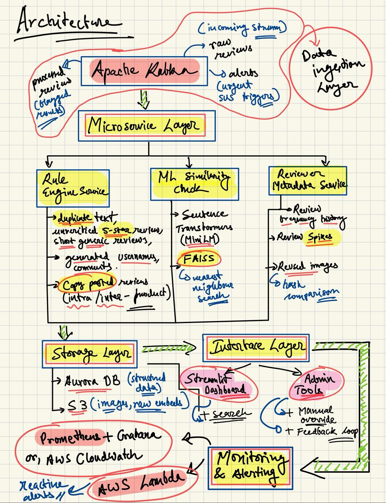

# 🧭 Planned Architecture Overview

This diagram shows the planned system design for detecting fake reviews and fake products.

---

## 🧩 System Components (as of now)

- **Data Source**: Raw reviews dataset (`more_simple_reviews.csv`)
- **Rule-Based Engine**: Flags suspicious reviews using duplicate detection, short/generic keyword checks, and purchase verification logic.
- **ML Similarity Engine**: Uses SentenceTransformer to find high-similarity review pairs via cosine similarity.
- **Flag Combiner**: Assigns trust scores based on rule and ML flags.
- **Output**: Generates a cleaned CSV (`reviews_flagged.csv`)
- **Streamlit App**: A UI for filtering and inspecting flagged reviews.

---

## 📌 Note
This diagram represents the **planned architecture** — actual implementation may vary slightly, but overall flow and components are consistent.

